# Задача 567. Permutation in String

## Условие:
```
Given two strings s1 and s2, return true if s2 contains a permutation of s1, or false otherwise.
In other words, return true if one of s1's permutations is the substring of s2.

Example 1:

Input: s1 = "ab", s2 = "eidbaooo"
Output: true
Explanation: s2 contains one permutation of s1 ("ba").

Example 2:

Input: s1 = "ab", s2 = "eidboaoo"
Output: false
 

Constraints:

1 <= s1.length, s2.length <= 10^4
s1 and s2 consist of lowercase English letters.
```

## Код:

```python
class Solution(object):
    def checkInclusion(self, s1, s2):
        from collections import Counter
        
        s1Count = Counter(s1)
        s2Count = Counter(s2[:len(s1)])
        
        if s1Count == s2Count:
            return True
        
        for i in range(len(s1), len(s2)):
            s2Count[s2[i]] += 1
            s2Count[s2[i - len(s1)]] -= 1
            if s2Count[s2[i - len(s1)]] == 0:
                del s2Count[s2[i - len(s1)]]
            if s1Count == s2Count:
                return True
        
        return False
```
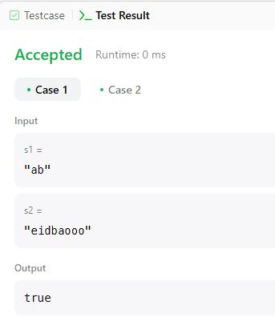
---
# Задача 410. Split Array Largest Sum

## Условие:
```
Given an integer array nums and an integer k, split nums into k non-empty subarrays such that the largest sum of any subarray is minimized.

Return the minimized largest sum of the split.

A subarray is a contiguous part of the array.

 

Example 1:

Input: nums = [7,2,5,10,8], k = 2
Output: 18
Explanation: There are four ways to split nums into two subarrays.
The best way is to split it into [7,2,5] and [10,8], where the largest sum among the two subarrays is only 18.

Example 2:

Input: nums = [1,2,3,4,5], k = 2
Output: 9
Explanation: There are four ways to split nums into two subarrays.
The best way is to split it into [1,2,3] and [4,5], where the largest sum among the two subarrays is only 9.
 

Constraints:

1 <= nums.length <= 1000
0 <= nums[i] <= 10^6
1 <= k <= min(50, nums.length)
```

## Код:

```python
class Solution(object):
    def splitArray(self, nums, k):
        def canSplit(nums, k, maxSum):
            currentSum = 0
            subarrays = 1
            for num in nums:
                if currentSum + num > maxSum:
                    currentSum = num
                    subarrays += 1
                    if subarrays > k:
                        return False
                else:
                    currentSum += num
            return True
    
        left, right = max(nums), sum(nums)
        while left < right:
            mid = (left + right) // 2
            if canSplit(nums, k, mid):
                right = mid
            else:
                left = mid + 1
        return left
```
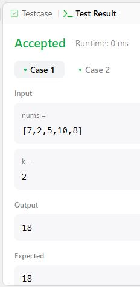
---
# Задача 636. Exclusive Time of Functions

## Условие:
```
On a single-threaded CPU, we execute a program containing n functions. Each function has a unique ID between 0 and n-1.

Function calls are stored in a call stack: when a function call starts, its ID is pushed onto the stack, and when a function call ends, its ID is popped off the stack. The function whose ID is at the top of the stack is the current function being executed. Each time a function starts or ends, we write a log with the ID, whether it started or ended, and the timestamp.

You are given a list logs, where logs[i] represents the ith log message formatted as a string "{function_id}:{"start" | "end"}:{timestamp}". For example, "0:start:3" means a function call with function ID 0 started at the beginning of timestamp 3, and "1:end:2" means a function call with function ID 1 ended at the end of timestamp 2. Note that a function can be called multiple times, possibly recursively.

A function's exclusive time is the sum of execution times for all function calls in the program. For example, if a function is called twice, one call executing for 2 time units and another call executing for 1 time unit, the exclusive time is 2 + 1 = 3.

Return the exclusive time of each function in an array, where the value at the ith index represents the exclusive time for the function with ID i.

Example 1:

Input: n = 2, logs = ["0:start:0","1:start:2","1:end:5","0:end:6"]
Output: [3,4]
Explanation:
Function 0 starts at the beginning of time 0, then it executes 2 for units of time and reaches the end of time 1.
Function 1 starts at the beginning of time 2, executes for 4 units of time, and ends at the end of time 5.
Function 0 resumes execution at the beginning of time 6 and executes for 1 unit of time.
So function 0 spends 2 + 1 = 3 units of total time executing, and function 1 spends 4 units of total time executing.

Example 2:

Input: n = 1, logs = ["0:start:0","0:start:2","0:end:5","0:start:6","0:end:6","0:end:7"]
Output: [8]
Explanation:
Function 0 starts at the beginning of time 0, executes for 2 units of time, and recursively calls itself.
Function 0 (recursive call) starts at the beginning of time 2 and executes for 4 units of time.
Function 0 (initial call) resumes execution then immediately calls itself again.
Function 0 (2nd recursive call) starts at the beginning of time 6 and executes for 1 unit of time.
Function 0 (initial call) resumes execution at the beginning of time 7 and executes for 1 unit of time.
So function 0 spends 2 + 4 + 1 + 1 = 8 units of total time executing.

Constraints:

1 <= n <= 100
1 <= logs.length <= 500
0 <= function_id < n
0 <= timestamp <= 10^9
No two start events will happen at the same timestamp.
No two end events will happen at the same timestamp.
Each function has an "end" log for each "start" log.
```

## Код:

```python
class Solution(object):
    def exclusiveTime(self, n, logs):
        stack = []
        times = [0] * n
        prev_time = 0

        for log in logs:
            fid, typ, time = log.split(':')
            fid, time = int(fid), int(time)
        
            if typ == 'start':
                if stack:
                    times[stack[-1]] += time - prev_time
                stack.append(fid)
                prev_time = time
            else:
                times[stack.pop()] += time - prev_time + 1
                prev_time = time + 1
    
        return times
```
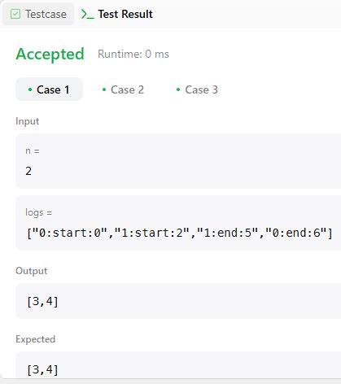
---
# Задача 673. Number of Longest Increasing Subsequence

## Условие:
```
Given an integer array nums, return the number of longest increasing subsequences.

Notice that the sequence has to be strictly increasing.

 

Example 1:

Input: nums = [1,3,5,4,7]
Output: 2
Explanation: The two longest increasing subsequences are [1, 3, 4, 7] and [1, 3, 5, 7].
Example 2:

Input: nums = [2,2,2,2,2]
Output: 5
Explanation: The length of the longest increasing subsequence is 1, and there are 5 increasing subsequences of length 1, so output 5.
 

Constraints:

1 <= nums.length <= 2000
-10^6 <= nums[i] <= 10^6
The answer is guaranteed to fit inside a 32-bit integer.
```

## Код:

```python
class Solution(object):
    def findNumberOfLIS(self, nums):
        n = len(nums)
        length = [1] * n
        count = [1] * n

        for i in range(n):
            for j in range(i):
                if nums[j] < nums[i]:
                    if length[j] + 1 > length[i]:
                        length[i] = length[j] + 1
                        count[i] = 0
                    if length[j] + 1 == length[i]:
                        count[i] += count[j]

        maxLength = max(length)
        result = 0

        for i in range(n):
            if length[i] == maxLength:
                result += count[i]

        return result
```
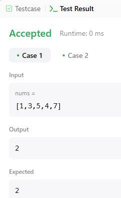
---
# Задача 672. Bulb Switcher II

## Условие:
```
There is a room with n bulbs labeled from 1 to n that all are turned on initially, and four buttons on the wall. Each of the four buttons has a different functionality where:

Button 1: Flips the status of all the bulbs.
Button 2: Flips the status of all the bulbs with even labels (i.e., 2, 4, ...).
Button 3: Flips the status of all the bulbs with odd labels (i.e., 1, 3, ...).
Button 4: Flips the status of all the bulbs with a label j = 3k + 1 where k = 0, 1, 2, ... (i.e., 1, 4, 7, 10, ...).
You must make exactly presses button presses in total. For each press, you may pick any of the four buttons to press.

Given the two integers n and presses, return the number of different possible statuses after performing all presses button presses.

 

Example 1:

Input: n = 1, presses = 1
Output: 2
Explanation: Status can be:
- [off] by pressing button 1
- [on] by pressing button 2
Example 2:

Input: n = 2, presses = 1
Output: 3
Explanation: Status can be:
- [off, off] by pressing button 1
- [on, off] by pressing button 2
- [off, on] by pressing button 3
Example 3:

Input: n = 3, presses = 1
Output: 4
Explanation: Status can be:
- [off, off, off] by pressing button 1
- [off, on, off] by pressing button 2
- [on, off, on] by pressing button 3
- [off, on, on] by pressing button 4
 

Constraints:

1 <= n <= 1000
0 <= presses <= 1000
```

## Код:

```python
class Solution(object):
    def flipLights(self, n, m):
        seen = set()
        n = min(n, 6)
        shift = max(0, 6 - n)
        for cand in range(16):
            bcount = bin(cand).count('1')
            if bcount % 2 == m % 2 and bcount <= m:
                lights = 0
                if ((cand >> 0) & 1) > 0: lights ^= 0b111111 >> shift
                if ((cand >> 1) & 1) > 0: lights ^= 0b010101 >> shift
                if ((cand >> 2) & 1) > 0: lights ^= 0b101010 >> shift
                if ((cand >> 3) & 1) > 0: lights ^= 0b100100 >> shift
                seen.add(lights)
        return len(seen)
```
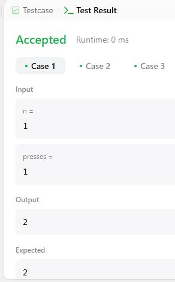
---

# Задача 670. Maximum Swap

## Условие:
```
You are given an integer num. You can swap two digits at most once to get the maximum valued number.

Return the maximum valued number you can get.

 

Example 1:

Input: num = 2736
Output: 7236
Explanation: Swap the number 2 and the number 7.
Example 2:

Input: num = 9973
Output: 9973
Explanation: No swap.
 

Constraints:

0 <= num <= 10^8
```

## Код:

```python
class Solution(object):
    def maximumSwap(self, num):
        A = list(str(num))
        ans = A[:]
        for i in range(len(A)):
            for j in range(i + 1, len(A)):
                A[i], A[j] = A[j], A[i]
                for k in range(len(A)):
                    if A[k] != ans[k]:
                        if A[k] > ans[k]:
                            ans = A[:]
                        break
                A[i], A[j] = A[j], A[i]
        return int(''.join(ans))
```
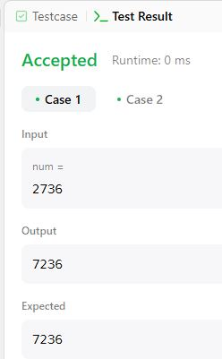
---
# Задача 669. Trim a Binary Search Tree

## Условие:
```
Given the root of a binary search tree and the lowest and highest boundaries as low and high, trim the tree so that all its elements lies in [low, high]. Trimming the tree should not change the relative structure of the elements that will remain in the tree (i.e., any node's descendant should remain a descendant). It can be proven that there is a unique answer.

Return the root of the trimmed binary search tree. Note that the root may change depending on the given bounds.

Example 1:
Input: root = [1,0,2], low = 1, high = 2
Output: [1,null,2]

Example 2:
Input: root = [3,0,4,null,2,null,null,1], low = 1, high = 3
Output: [3,2,null,1]
 

Constraints:

The number of nodes in the tree is in the range [1, 10^4].
0 <= Node.val <= 10^4
The value of each node in the tree is unique.
root is guaranteed to be a valid binary search tree.
0 <= low <= high <= 10^4
```

## Код:

```python
# Definition for a binary tree node.
class TreeNode(object):
    def __init__(self, val=0, left=None, right=None):
        self.val = val
        self.left = left
        self.right = right
class Solution(object):
    def trimBST(self, root, low, high):
        if not root:
            return None
        if root.val > high:
            return self.trimBST(root.left, low, high)
        if root.val < low:
            return self.trimBST(root.right, low, high)
        root.left = self.trimBST(root.left, low, high)
        root.right = self.trimBST(root.right, low, high)
        return root
```
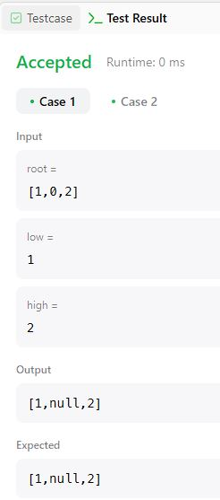
---
# Задача 565. Array Nesting

## Условие:
```
You are given an integer array nums of length n where nums is a permutation of the numbers in the range [0, n - 1].

You should build a set s[k] = {nums[k], nums[nums[k]], nums[nums[nums[k]]], ... } subjected to the following rule:

The first element in s[k] starts with the selection of the element nums[k] of index = k.
The next element in s[k] should be nums[nums[k]], and then nums[nums[nums[k]]], and so on.
We stop adding right before a duplicate element occurs in s[k].
Return the longest length of a set s[k].

 

Example 1:
Input: nums = [5,4,0,3,1,6,2]
Output: 4
Explanation: 
nums[0] = 5, nums[1] = 4, nums[2] = 0, nums[3] = 3, nums[4] = 1, nums[5] = 6, nums[6] = 2.
One of the longest sets s[k]:
s[0] = {nums[0], nums[5], nums[6], nums[2]} = {5, 6, 2, 0}

Example 2:
Input: nums = [0,1,2]
Output: 1
 

Constraints:

1 <= nums.length <= 10^5
0 <= nums[i] < nums.length
All the values of nums are unique
```

## Код:

```python
class Solution(object):
    def arrayNesting(self, nums):
        visited = [False] * len(nums)
        max_length = 0
        
        for i in range(len(nums)):
            if not visited[i]:
                start = i
                count = 0
                while not visited[start]:
                    visited[start] = True
                    start = nums[start]
                    count += 1
                max_length = max(max_length, count)
        
        return max_length
```
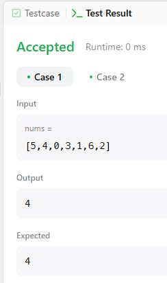
---
# Задача 624. Maximum Distance in Arrays

## Условие:
```
You are given m arrays, where each array is sorted in ascending order.

You can pick up two integers from two different arrays (each array picks one) and calculate the distance. We define the distance between two integers a and b to be their absolute difference |a - b|.

Return the maximum distance.

 

Example 1:

Input: arrays = [[1,2,3],[4,5],[1,2,3]]
Output: 4
Explanation: One way to reach the maximum distance 4 is to pick 1 in the first or third array and pick 5 in the second array.
Example 2:

Input: arrays = [[1],[1]]
Output: 0
 

Constraints:

m == arrays.length
2 <= m <= 10^5
1 <= arrays[i].length <= 500
-10^4 <= arrays[i][j] <= 10^4
arrays[i] is sorted in ascending order.
There will be at most 105 integers in all the arrays.
```

## Код:

```python
class Solution(object):
    def maxDistance(self, arrays):
        min_val = arrays[0][0]
        max_val = arrays[0][-1]
        max_distance = 0
    
        for i in range(1, len(arrays)):
            max_distance = max(max_distance, abs(arrays[i][-1] - min_val), abs(arrays[i][0] - max_val))
            min_val = min(min_val, arrays[i][0])
            max_val = max(max_val, arrays[i][-1])
    
        return max_distance
```
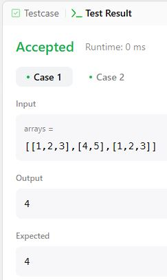
---
# Задача 621. Task Scheduler

## Условие:
```
You are given an array of CPU tasks, each labeled with a letter from A to Z, and a number n. Each CPU interval can be idle or allow the completion of one task. Tasks can be completed in any order, but there's a constraint: there has to be a gap of at least n intervals between two tasks with the same label.

Return the minimum number of CPU intervals required to complete all tasks.

 

Example 1:

Input: tasks = ["A","A","A","B","B","B"], n = 2

Output: 8

Explanation: A possible sequence is: A -> B -> idle -> A -> B -> idle -> A -> B.

After completing task A, you must wait two intervals before doing A again. The same applies to task B. In the 3rd interval, neither A nor B can be done, so you idle. By the 4th interval, you can do A again as 2 intervals have passed.

Example 2:

Input: tasks = ["A","C","A","B","D","B"], n = 1

Output: 6

Explanation: A possible sequence is: A -> B -> C -> D -> A -> B.

With a cooling interval of 1, you can repeat a task after just one other task.

Example 3:

Input: tasks = ["A","A","A", "B","B","B"], n = 3

Output: 10

Explanation: A possible sequence is: A -> B -> idle -> idle -> A -> B -> idle -> idle -> A -> B.

There are only two types of tasks, A and B, which need to be separated by 3 intervals. This leads to idling twice between repetitions of these tasks.

 

Constraints:

1 <= tasks.length <= 10^4
tasks[i] is an uppercase English letter.
0 <= n <= 100
```

## Код:

```python
from collections import Counter
class Solution(object):
    def leastInterval(self, tasks, n):
        task_counts = Counter(tasks)
        max_freq = max(task_counts.values())
        count_max_freq = list(task_counts.values()).count(max_freq)
    
        return max(len(tasks), (max_freq - 1) * (n + 1) + count_max_freq)
```
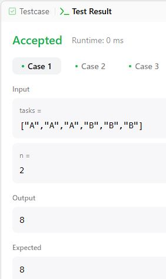
---
# Задача 525. Contiguous Array

## Условие:
```
Given a binary array nums, return the maximum length of a contiguous subarray with an equal number of 0 and 1.

 

Example 1:

Input: nums = [0,1]
Output: 2
Explanation: [0, 1] is the longest contiguous subarray with an equal number of 0 and 1.
Example 2:

Input: nums = [0,1,0]
Output: 2
Explanation: [0, 1] (or [1, 0]) is a longest contiguous subarray with equal number of 0 and 1.
 

Constraints:

1 <= nums.length <= 10^5
nums[i] is either 0 or 1.
```

## Код:

```python
class Solution(object):
    def findMaxLength(self, nums):
        count_map = {0: -1}
        max_length = 0
        count = 0
        
        for i, num in enumerate(nums):
            count += 1 if num == 1 else -1
            
            if count in count_map:
                max_length = max(max_length, i - count_map[count])
            else:
                count_map[count] = i
        
        return max_length
```
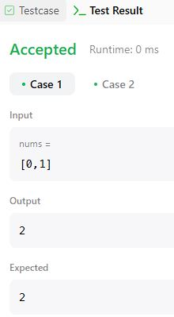
---
# Задача 435. Non-overlapping Intervals

## Условие:
```
Given an array of intervals intervals where intervals[i] = [starti, endi], return the minimum number of intervals you need to remove to make the rest of the intervals non-overlapping.

Note that intervals which only touch at a point are non-overlapping. For example, [1, 2] and [2, 3] are non-overlapping.

 

Example 1:

Input: intervals = [[1,2],[2,3],[3,4],[1,3]]
Output: 1
Explanation: [1,3] can be removed and the rest of the intervals are non-overlapping.
Example 2:

Input: intervals = [[1,2],[1,2],[1,2]]
Output: 2
Explanation: You need to remove two [1,2] to make the rest of the intervals non-overlapping.
Example 3:

Input: intervals = [[1,2],[2,3]]
Output: 0
Explanation: You don't need to remove any of the intervals since they're already non-overlapping.
 

Constraints:

1 <= intervals.length <= 105
intervals[i].length == 2
-5 * 10^4 <= starti < endi <= 5 * 10^4
```

## Код:

```python
class Solution(object):
    def eraseOverlapIntervals(self, intervals):
        intervals.sort(key=lambda x: x[1])
        ans = 0
        k = float('-inf')
        
        for x, y in intervals:
            if x >= k:
                k = y
            else:
                ans += 1
        
        return ans
```
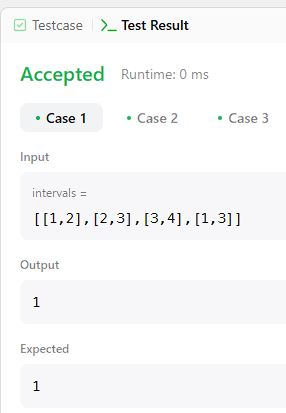


