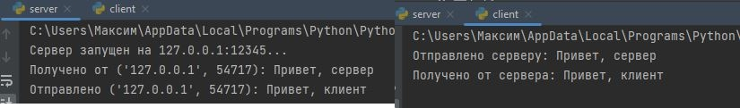

# Задача 1: UDP Клиент-Серверное Взаимодействие


### Скриншот результата:



## Описание
Эта задача реализует простое клиент-серверное приложение с использованием **UDP сокетов**. Сервер слушает входящие сообщения от клиента, отвечает заранее определённым сообщением и логирует взаимодействие. Клиент отправляет сообщение серверу и получает ответ.

---

## Возможности
- **Сервер**:
  - Слушает сообщения от клиентов на указанном хосте и порту.
  - Обрабатывает полученные сообщения и отправляет ответ: `"Привет, клиент"`.

- **Клиент**:
  - Отправляет сообщение: `"Привет, сервер"` серверу.
  - Получает и отображает ответ от сервера.

---

## Код на серверной стороне

### Основной функционал:
- Запускает UDP сервер, который слушает на `127.0.0.1:12345`.
- Принимает сообщения от клиентов и логирует адрес отправителя и само сообщение.
- Отправляет ответное сообщение обратно клиенту.

```python
import socket

def start_server(host='127.0.0.1', port=12345):
    server_socket = socket.socket(socket.AF_INET, socket.SOCK_DGRAM)
    server_socket.bind((host, port))
    print(f"Сервер запущен на {host}:{port}...")

    while True:
        try:
            message, client_address = server_socket.recvfrom(1024)
            print(f"Получено от {client_address}: {message.decode()}")

            response = "Привет, клиент"
            server_socket.sendto(response.encode(), client_address)
            print(f"Отправлено {client_address}: {response}")
        except Exception as e:
            print(f"Ошибка: {e}")
            break

if __name__ == "__main__":
    start_server()
```