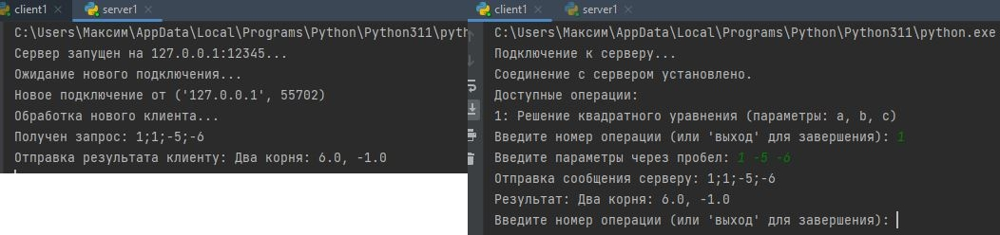

# Задача 2: Клиент-Серверное Решение Квадратного Уравнения


### Скриншот результата:


## Описание
Эта задача реализует клиент-серверное приложение для решения квадратных уравнений. 
- **Сервер** обрабатывает запросы от клиента, выполняет вычисления и возвращает результаты.
- **Клиент** отправляет параметры квадратного уравнения на сервер и отображает полученные решения.

---

## Возможности
- **Сервер**:
  - Обрабатывает запросы от нескольких клиентов.
  - Поддерживает решение квадратных уравнений в формате: `ax^2 + bx + c = 0`.
  - Выполняет расчёты:
    - Вычисляет дискриминант.
    - Находит корни уравнения (если существуют действительные решения).

- **Клиент**:
  - Предоставляет интерфейс для ввода типа операции и параметров (`a`, `b`, `c`).
  - Отправляет данные на сервер и получает решение.

---

## Код на серверной стороне

### Основной функционал:
1. Принимает подключения клиентов и обрабатывает запросы.
2. Разбирает входные данные для определения типа операции и параметров.
3. Решает квадратное уравнение:
   - Возвращает ошибку, если параметры введены некорректно.
   - Вычисляет корни на основе значения дискриминанта.

```python
import socket
import math

def handle_client(client_socket):
    print("Обработка нового клиента...")
    while True:
        request = client_socket.recv(1024).decode()
        if not request:
            break

        print(f"Получен запрос: {request}")
        data = request.split(";")
        operation = data[0]
        parameters = list(map(float, data[1:])) if len(data) > 1 else []

        if operation == "1":
            if len(parameters) != 3:
                result = "Ошибка: Для решения квадратного уравнения требуется 3 параметра (a, b, c)."
            else:
                a, b, c = parameters
                discriminant = b**2 - 4*a*c
                if discriminant < 0:
                    result = "Нет действительных корней."
                elif discriminant == 0:
                    root = -b / (2 * a)
                    result = f"Один корень: {root}"
                else:
                    root1 = (-b + math.sqrt(discriminant)) / (2 * a)
                    root2 = (-b - math.sqrt(discriminant)) / (2 * a)
                    result = f"Два корня: {root1}, {root2}"
        else:
            result = "Ошибка: Неизвестная операция."

        client_socket.send(result.encode())

def start_server(host='127.0.0.1', port=12345):
    server_socket = socket.socket(socket.AF_INET, socket.SOCK_STREAM)
    server_socket.bind((host, port))
    server_socket.listen(5)
    print(f"Сервер запущен на {host}:{port}...")

    while True:
        client_socket, client_address = server_socket.accept()
        print(f"Подключение от {client_address}")
        handle_client(client_socket)
```