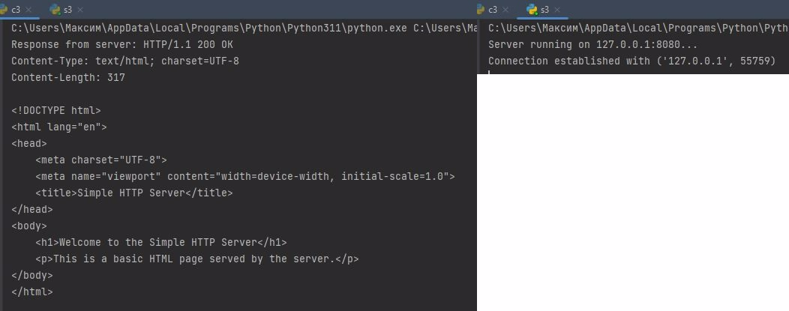

# Задача 3: Простой HTTP Сервер


### Скриншот казни:


## Описание
Эта задача реализует базовое приложение с **HTTP сервером и клиентом**:
- **Сервер** возвращает HTML-файл (`index.html`) в ответ на входящие HTTP GET запросы.
- **Клиент** может отправлять GET и POST запросы на сервер.

---

## Возможности
- **Сервер**:
  - Обрабатывает HTTP GET запросы и возвращает файл `index.html`.
  - Возвращает ошибку 404, если файл не найден.

- **Клиент**:
  - Отправляет GET запросы для получения HTML-страницы.
  - Отправляет POST запросы с данными в формате ключ-значение (`discipline` и `grade`).

---

## Код на серверной стороне

### Основной функционал:
1. **Обработка запросов**:
   - Читает `index.html` и возвращает его в ответ на запрос.
   - Если файл отсутствует, возвращает ошибку 404 с пользовательской страницей ошибки.

2. **Запуск сервера**:
   - Сервер работает на `127.0.0.1:8080`.
   - Ожидает входящих подключений от клиентов и обрабатывает их запросы.

```python
import socket

def handle_request(client_socket):
    try:
        with open("index.html", "r") as html_file:
            content = html_file.read()

        response = (
            "HTTP/1.1 200 OK\r\n"
            "Content-Type: text/html; charset=UTF-8\r\n"
            f"Content-Length: {len(content)}\r\n"
            "\r\n"
            f"{content}"
        )
    except FileNotFoundError:
        response = (
            "HTTP/1.1 404 Not Found\r\n"
            "Content-Type: text/html; charset=UTF-8\r\n"
            "\r\n"
            "<html><body><h1>404 Not Found</h1></body></html>"
        )

    client_socket.send(response.encode())

def start_server(host='127.0.0.1', port=8080):
    server_socket = socket.socket(socket.AF_INET, socket.SOCK_STREAM)
    server_socket.bind((host, port))
    server_socket.listen(5)
    print(f"Сервер запущен на {host}:{port}...")

    while True:
        client_socket, client_address = server_socket.accept()
        print(f"Установлено соединение с {client_address}")

        handle_request(client_socket)
        client_socket.close()

if __name__ == "__main__":
    start_server()
```