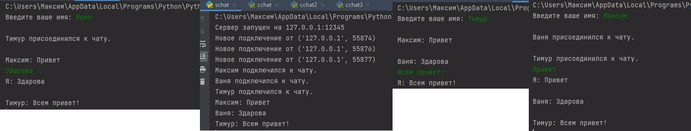

# Задача 4: Многопользовательская Чат-Система

### Скриншот казни:


## Описание
Эта задача реализует **многопользовательскую чат-систему**:
- **Сервер** управляет несколькими клиентами, транслирует сообщения и поддерживает список подключенных пользователей.
- **Клиенты** подключаются к серверу, отправляют сообщения и получают сообщения от других участников.

---

## Возможности
- **Сервер**:
  - Обрабатывает подключение нескольких клиентов одновременно с использованием потоков.
  - Хранит список подключенных клиентов и их имена.
  - Транслирует сообщения всем клиентам, кроме отправителя.

- **Клиент**:
  - Отправляет сообщения серверу.
  - Получает и отображает сообщения от других участников в режиме реального времени.
  - Позволяет пользователю ввести имя при подключении.

---

## Код на серверной стороне

### Основной функционал:
1. Принимает подключения клиентов и назначает им имена.
2. Транслирует сообщения всем клиентам, кроме отправителя.
3. Удаляет клиентов, которые отключились.

```python
import socket
import threading

clients = {}

def broadcast(message, sender_socket):
    for client_socket, client_name in clients.items():
        if client_socket != sender_socket:
            try:
                client_socket.send(message.encode())
            except:
                client_socket.close()
                del clients[client_socket]

def handle_client(client_socket):
    try:
        client_name = client_socket.recv(1024).decode()
        clients[client_socket] = client_name
        print(f"{client_name} подключился к чату.")
        broadcast(f"{client_name} присоединился к чату.", client_socket)

        while True:
            message = client_socket.recv(1024).decode()
            if message:
                print(f"{client_name}: {message}")
                broadcast(f"{client_name}: {message}", client_socket)
            else:
                break
    except:
        pass
    finally:
        print(f"{clients[client_socket]} отключился.")
        broadcast(f"{clients[client_socket]} покинул чат.", client_socket)
        client_socket.close()
        del clients[client_socket]

def start_server(host='127.0.0.1', port=12345):
    server_socket = socket.socket(socket.AF_INET, socket.SOCK_STREAM)
    server_socket.bind((host, port))
    server_socket.listen(5)
    print(f"Сервер запущен на {host}:{port}")

    while True:
        client_socket, client_address = server_socket.accept()
        print(f"Новое подключение от {client_address}")

        client_thread = threading.Thread(target=handle_client, args=(client_socket,))
        client_thread.start()

if __name__ == "__main__":
    start_server()
```