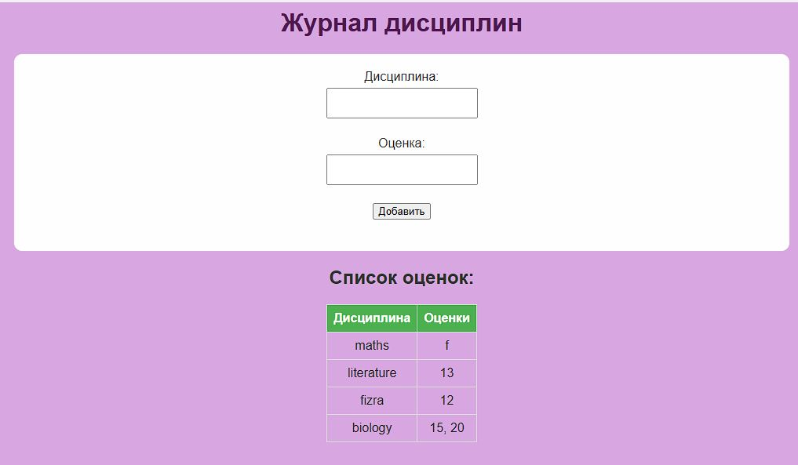

# Задача 5: Динамический Журнал Дисциплин и Оценок


### Скриншот:



## Описание
Эта задача реализует **динамический веб-журнал**, в котором пользователи могут:
1. Добавлять оценки для различных дисциплин через веб-форму.
2. Просматривать все дисциплины и соответствующие оценки в структурированной HTML-таблице.

---

## Возможности
- **Сервер**:
  - Обрабатывает HTTP GET запросы для отображения журнала и формы.
  - Обрабатывает HTTP POST запросы для обновления журнала новыми оценками.
  - Динамически генерирует HTML-страницу на основе сохранённых данных.

- **Клиент**:
  - Отправляет POST запросы для добавления оценки по определённой дисциплине.
  - Отправляет GET запросы для получения текущего состояния журнала.

---

## Код на серверной стороне

### Основной функционал:
1. **Генерация HTML**:
   - Создаёт форму для добавления оценок и таблицу для отображения всех сохранённых данных.
   - Оценки по каждой дисциплине отображаются в одной строке, разделённые запятыми.

2. **Обработка запросов**:
   - **GET**: Возвращает HTML-страницу с текущими данными журнала.
   - **POST**: Обновляет данные, добавляя новую оценку по указанной дисциплине.

3. **Хранение данных**:
   - Использует словарь, где ключ — дисциплина, а значение — список оценок.

```python
import socket

disciplines_data = {}

def generate_html():
    html = """
    <html>
    <head>
        <meta charset="UTF-8">
        <title>Журнал дисциплин</title>
        <style>
            body { font-family: Arial, sans-serif; background-color: #d8a7e1; color: #333; text-align: center; }
            h1 { color: #4d194d; }
            table { margin: 0 auto; border-collapse: collapse; }
            th, td { border: 1px solid #ddd; padding: 8px; text-align: center; }
            th { background-color: #4CAF50; color: white; }
            input { margin: 5px; padding: 10px; }
            form { margin-bottom: 20px; }
            .form-container { margin: 20px auto; background-color: #fefefe; padding: 20px; border-radius: 10px; width: 50%; }
        </style>
    </head>
    <body>
        <h1>Журнал дисциплин</h1>
        <div class="form-container">
            <form method="POST">
                <label for="discipline">Дисциплина:</label><br>
                <input type="text" id="discipline" name="discipline" required><br><br>
                <label for="grade">Оценка:</label><br>
                <input type="text" id="grade" name="grade" required><br><br>
                <button type="submit">Добавить</button>
            </form>
        </div>
        <h2>Список оценок:</h2>
        <table>
            <tr>
                <th>Дисциплина</th>
                <th>Оценки</th>
            </tr>
    """
    if disciplines_data:
        for discipline, grades in disciplines_data.items():
            grades_str = ", ".join(grades)
            html += f"<tr><td>{discipline}</td><td>{grades_str}</td></tr>"
    else:
        html += "<tr><td colspan='2'>Данные отсутствуют</td></tr>"

    html += """
        </table>
    </body>
    </html>
    """
    return html

def handle_request(client_socket):
    request = client_socket.recv(1024).decode()
    headers = request.split("\r\n")
    method = headers[0].split()[0]

    if method == "GET":
        response = generate_html()
        client_socket.send("HTTP/1.1 200 OK\r\nContent-Type: text/html\r\n\r\n".encode())
        client_socket.send(response.encode())

    elif method == "POST":
        body = request.split("\r\n\r\n")[1]
        post_data = body.split("&")
        discipline = post_data[0].split("=")[1]
        grade = post_data[1].split("=")[1]

        if discipline in disciplines_data:
            disciplines_data[discipline].append(grade)
        else:
            disciplines_data[discipline] = [grade]

        response = "HTTP/1.1 303 See Other\r\nLocation: /\r\n\r\n"
        client_socket.send(response.encode())

    client_socket.close()

def start_server():
    server_socket = socket.socket(socket.AF_INET, socket.SOCK_STREAM)
    server_socket.bind(('localhost', 8080))
    server_socket.listen(5)
    print("Сервер запущен на http://localhost:8080/")

    while True:
        client_socket, _ = server_socket.accept()
        handle_request(client_socket)

if __name__ == "__main__":
    start_server()
```